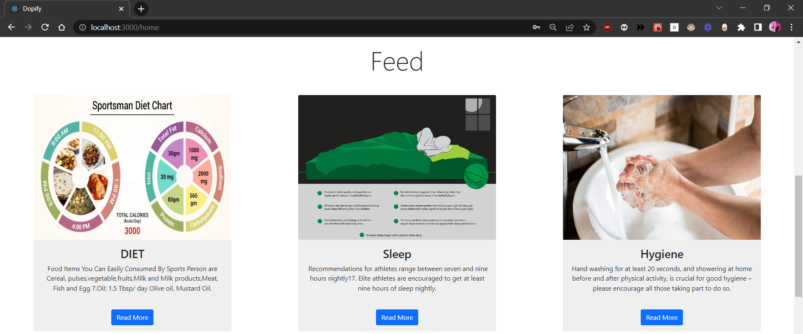

    

# MINI PROJECT

# What is the problem we are trying to solve

> Unknowingly sports persons tend to consume drugs containing prohibited substances which can result in positive dope test.
> So we have Built a web application for sports community to identify the Prohibited substances and Therapeutic Use Exception

# Purpose of the website

- #### To **create awareness** among the emerging sports persons to identify the Prohibited substances and Therapeutic Use Exception.
- #### To avoid **prohibited drug in lack of knowledge** of doping in sports.
- #### **Significance of TUE** doping in sports.
- #### To create a **social platform** for general and sports persons.

# Our solution

- #### To **identify products containing prohibited substances** using text extraction by OCR
- #### Connecting general public with sportsperson by **establishing a community** to promote best lifestyle practices, healthier food alternatives, etc
- #### To **spread awareness** about prohibited substances among sports person by sharing informational posts.
- #### Users can make use of **discussion forum** to interact with other users to share their knowledge and findings.
- #### Highlight the importance of **Therapeutic Use Exception abuse**.
- #### Enabling users to clear their FAQs using **chatbot**.

# Here is how it looks

